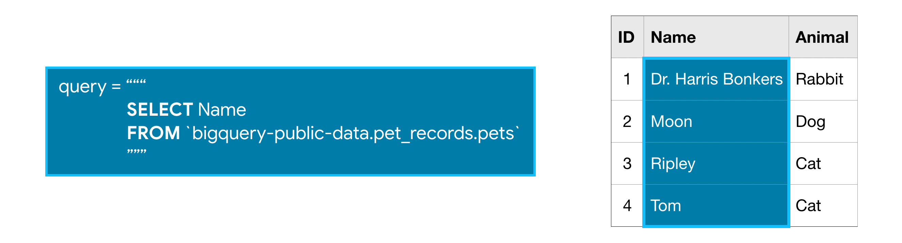

# SQL (Structured Query Language)
Getting solid in SQL.

This repository documents my journey to building strong SQL fundamentals through practical queries and exercises. The focus is on understanding how to retrieve, manipulate, and analyze data efficiently using SQL while working with relational databases. All queries in this repository are written and tested using MySQL Workbench and VS Code with a MySQL extension for query execution.
The repository is structured around core SQL concepts, progressing from basic queries to more advanced techniques commonly used in real-world data analysis.

---

## Lessons Covered

### 1. Getting Started With SQL
Introduction to SQL and relational databases.

Topics include:
- What SQL is used for
- Basic database concepts
- Understanding relational databases
- Writing and executing queries

---

### 2. SELECT, FROM & WHERE
The foundation of most SQL queries.

Topics include:
- Selecting specific columns
- Querying tables
- Filtering rows with conditions
- Comparison operators and logical operators (`AND`, `OR`, `NOT`)

---

### 3. GROUP BY, HAVING & COUNT
Using aggregation to summarize data and extract insights.

Topics include:
- Aggregate functions (`COUNT`, `SUM`, `AVG`, `MIN`, `MAX`)
- Grouping data using `GROUP BY`
- Filtering aggregated results with `HAVING`

---

### 4. ORDER BY
Sorting query results to make data easier to interpret.

Topics include:
- Sorting results in ascending and descending order
- Ordering by multiple columns

---

### 5. AS & WITH
Improving query readability and structure.

Topics include:
- Column and table aliases using `AS`
- Common Table Expressions (CTEs) using `WITH`
- Writing cleaner and more maintainable queries

---

### 6. Joining Data
Combining information from multiple tables within relational databases.

Topics include:
- `INNER JOIN`
- `LEFT JOIN`
- `RIGHT JOIN`
- Understanding relationships between tables

---

## Goals of This Repository

- Strengthen SQL fundamentals
- Practice working with relational databases
- Write efficient and readable queries
- Build a reference of commonly used SQL techniques

---

## Tools Used

- **MySQL**
- Relational databases
- SQL query editors / database clients
