# SQL (Structured Query Language)
Getting solid in SQL.

This repository documents my journey to building strong SQL fundamentals through practical queries and exercises. The focus is on understanding how to retrieve, manipulate, and analyze data efficiently using SQL while working with relational databases. All queries in this repository are written and tested using MySQL Workbench and VS Code with a MySQL extension for query execution.
The repository is structured around core SQL concepts, progressing from basic queries to more advanced techniques commonly used in real-world data analysis.

---

## Lessons Covered

### 1. Getting Started With SQL
Introduction to SQL and relational databases.

Topics include:
- What SQL is used for
- Basic database concepts
- Understanding relational databases
- Writing and executing queries

---

### 2. SELECT, FROM & WHERE
The foundation of most SQL queries.

Topics include:
- Selecting specific columns
- Querying tables
- Filtering rows with conditions
- Comparison operators and logical operators (`AND`, `OR`, `NOT`)

#### SELECT ... FROM

The most basic SQL query selects a single column from a single table. To do this,

- specify the column you want after the word SELECT, and then
- specify the table after the word FROM.

For instance, to select the Name column (from the pets table in the pet_records database in the bigquery-public-data project), our query would appear as follows:

#### WHERE ...

We can return only the rows meeting specific conditions. Do this using the WHERE clause.

The query below returns the entries from the Name column that are in rows where the Animal column has the text 'Cat'.

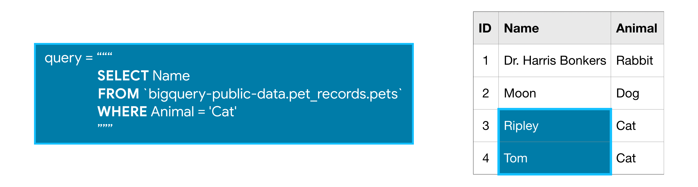

---

### 3. GROUP BY, HAVING & COUNT
Using aggregation to summarize data and extract insights.

Topics include:
- Aggregate functions (`COUNT`, `SUM`, `AVG`, `MIN`, `MAX`)
- Grouping data using `GROUP BY`
- Filtering aggregated results with `HAVING`

#### COUNT()

COUNT(), as you may have guessed from the name, returns a count of things. If you pass it the name of a column, it will return the number of entries in that column.

For instance, if we SELECT the COUNT() of the ID column in the pets table, it will return 4, because there are 4 ID's in the table.

**COUNT()** is an example of an aggregate function, which takes many values and returns one. (Other examples of aggregate functions include SUM(), AVG(), MIN(), and MAX().)

#### GROUP BY

GROUP BY takes the name of one or more columns, and treats all rows with the same value in that column as a single group when you apply aggregate functions like COUNT().

For example, say we want to know how many of each type of animal we have in the pets table. We can use GROUP BY to group together rows that have the same value in the Animal column, while using COUNT() to find out how many ID's we have in each group.

#### GROUP BY ... HAVING

HAVING is used in combination with GROUP BY to ignore groups that don't meet certain criteria.

So this query, for example, will only include groups that have more than one ID in them.

---

### 4. ORDER BY
Sorting query results to make data easier to interpret.

Topics include:
- Sorting results in ascending and descending order
- Ordering by multiple columns

#### ORDER BY

ORDER BY is usually the last clause in your query, and it sorts the results returned by the rest of your query.

Notice that the rows are not ordered by the ID column. We can quickly remedy this with the query below.

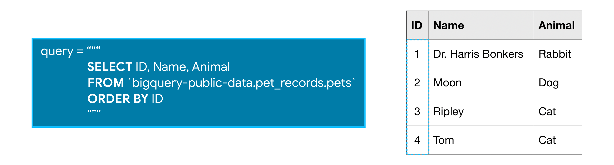

The ORDER BY clause also works for columns containing text, where the results show up in alphabetical order.

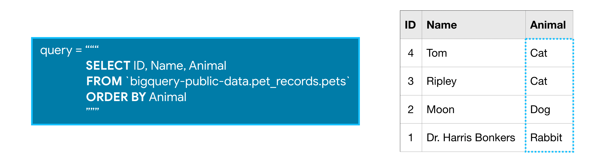

You can reverse the order using the DESC argument (short for 'descending'). The next query sorts the table by the Animal column, where the values that are last in alphabetic order are returned first.

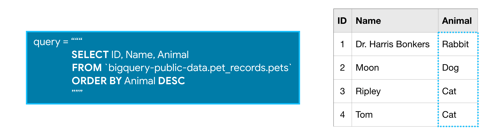

#### Dates

Next, we'll talk about dates, because they come up very frequently in real-world databases. There are two ways that dates can be stored in BigQuery: as a DATE or as a DATETIME.

The DATE format has the year first, then the month, and then the day. It looks like this:

    YYYY-[M]M-[D]D

- YYYY: Four-digit year
- [M]M: One or two digit month
- [D]D: One or two digit day

So 2019-01-10 is interpreted as January 10, 2019.

The DATETIME format is like the date format ... but with time added at the end.

#### EXTRACT

Often you'll want to look at part of a date, like the year or the day. You can do this with EXTRACT. We'll illustrate this with a slightly different table, called pets_with_date.

The query below returns two columns, where column Day contains the day corresponding to each entry the Date column from the pets_with_date table:

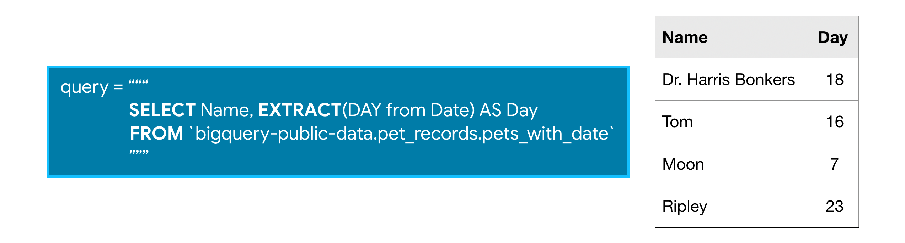

SQL is very smart about dates, and we can ask for information beyond just extracting part of the cell. For example, this query returns one column with just the week in the year (between 1 and 53) for each date in the Date column:

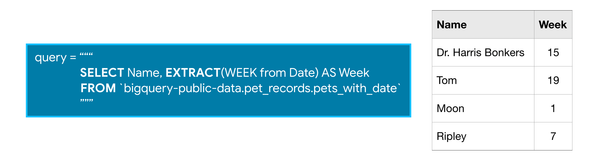

---

### 5. AS & WITH
Improving query readability and structure.

Topics include:
- Column and table aliases using `AS`
- Common Table Expressions (CTEs) using `WITH`
- Writing cleaner and more maintainable queries

#### AS

You learned in an earlier tutorial how to use AS to rename the columns generated by your queries, which is also known as aliasing. This is similar to how Python uses as for aliasing when doing imports like import pandas as pd or import seaborn as sns.

To use AS in SQL, insert it right after the column you select. Here's an example of a query without an AS clause:

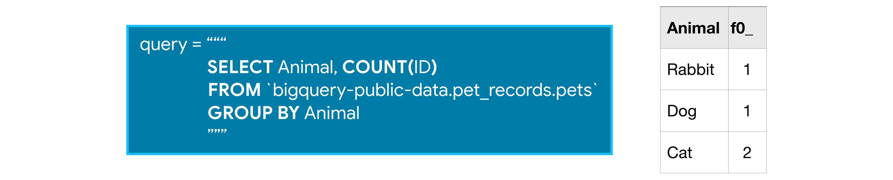

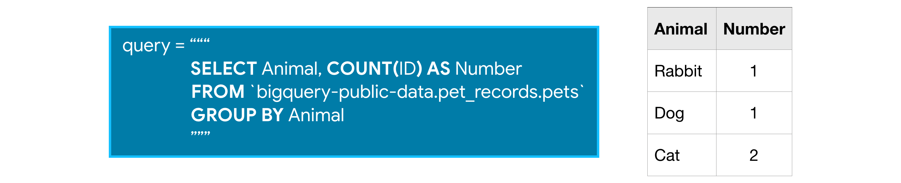

#### WITH ... AS

On its own, AS is a convenient way to clean up the data returned by your query. It's even more powerful when combined with WITH in what's called a "common table expression".

A common table expression (or CTE) is a temporary table that you return within your query. CTEs are helpful for splitting your queries into readable chunks, and you can write queries against them.

For instance, you might want to use the pets table to ask questions about older animals in particular. So you can start by creating a CTE which only contains information about animals more than five years old like this:

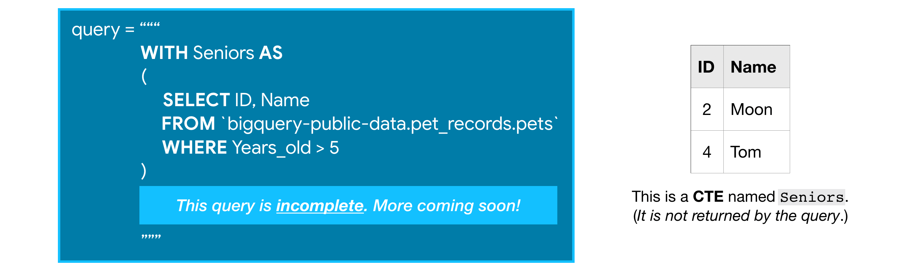

While this incomplete query above won't return anything, it creates a CTE that we can then refer to (as Seniors) while writing the rest of the query.

We can finish the query by pulling the information that we want from the CTE. The complete query below first creates the CTE, and then returns all of the IDs from it.

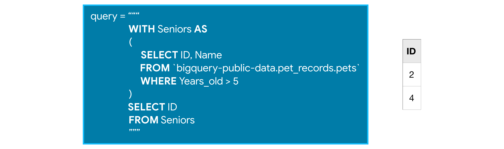

Also, it's important to note that CTEs only exist inside the query where you create them, and you can't reference them in later queries. So, any query that uses a CTE is always broken into two parts: (1) first, we create the CTE, and then (2) we write a query that uses the CTE.

---

### 6. Joining Data
Combining information from multiple tables within relational databases.

Topics include:
- `INNER JOIN`
- `LEFT JOIN`
- `RIGHT JOIN`
- Understanding relationships between tables

#### Example

We'll use our imaginary pets table, which has three columns:

- ID - ID number for the pet
- Name - name of the pet
- Animal - type of animal

We'll also add another table, called owners. This table also has three columns:

- ID - ID number for the owner (different from the ID number for the pet)
- Name - name of the owner
- Pet_ID - ID number for the pet that belongs to the owner (which matches the ID number for the pet in the pets table)

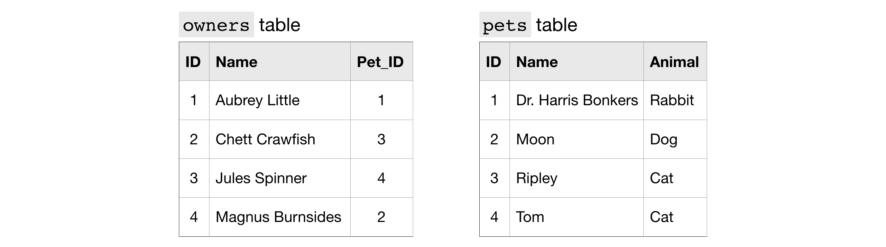

To get information that applies to a certain pet, we match the ID column in the pets table to the Pet_ID column in the owners table.

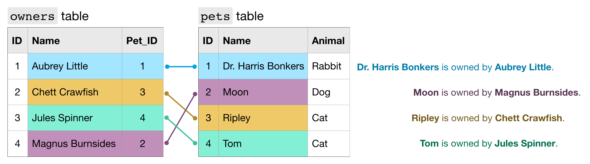

For example,

- the pets table shows that Dr. Harris Bonkers is the pet with ID 1.
- The owners table shows that Aubrey Little is the owner of the pet with ID 1.

Putting these two facts together, Dr. Harris Bonkers is owned by Aubrey Little.

Fortunately, we don't have to do this by hand to figure out which owner goes with which pet. In the next section, you'll learn how to use JOIN to create a new table combining information from the pets and owners tables.

#### JOIN

Using JOIN, we can write a query to create a table with just two columns: the name of the pet and the name of the owner.

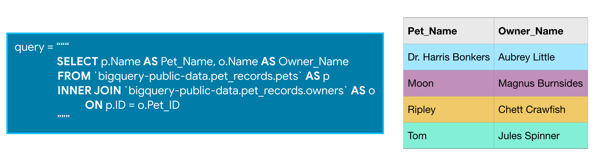

We combine information from both tables by matching rows where the ID column in the pets table matches the Pet_ID column in the owners table.

In the query, ON determines which column in each table to use to combine the tables. Notice that since the ID column exists in both tables, we have to clarify which one to use. We use p.ID to refer to the ID column from the pets table, and o.Pet_ID refers to the Pet_ID column from the owners table.

- In general, when you're joining tables, it's a good habit to specify which table each of your columns comes from. That way, you don't have to pull up the schema every time you go back to read the query.

The type of JOIN we're using today is called an INNER JOIN. That means that a row will only be put in the final output table if the value in the columns you're using to combine them shows up in both the tables you're joining. For example, if Tom's ID number of 4 didn't exist in the pets table, we would only get 3 rows back from this query. There are other types of JOIN, but an INNER JOIN is very widely used, so it's a good one to start with.

---

## Goals of This Repository

- Strengthen SQL fundamentals
- Practice working with relational databases
- Write efficient and readable queries
- Build a reference of commonly used SQL techniques

---

## Tools Used

- **MySQL**
- Relational databases
- SQL query editors / database clients
